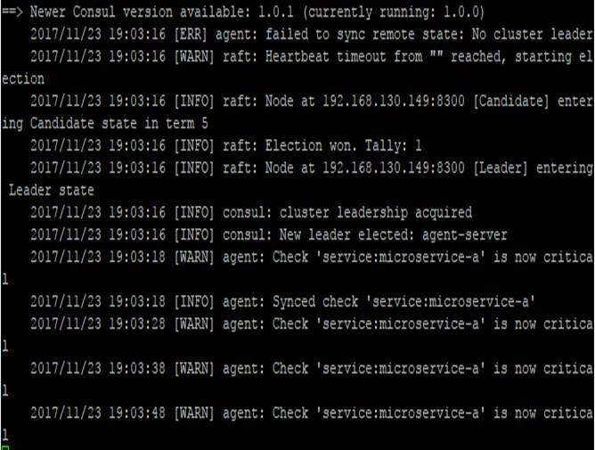
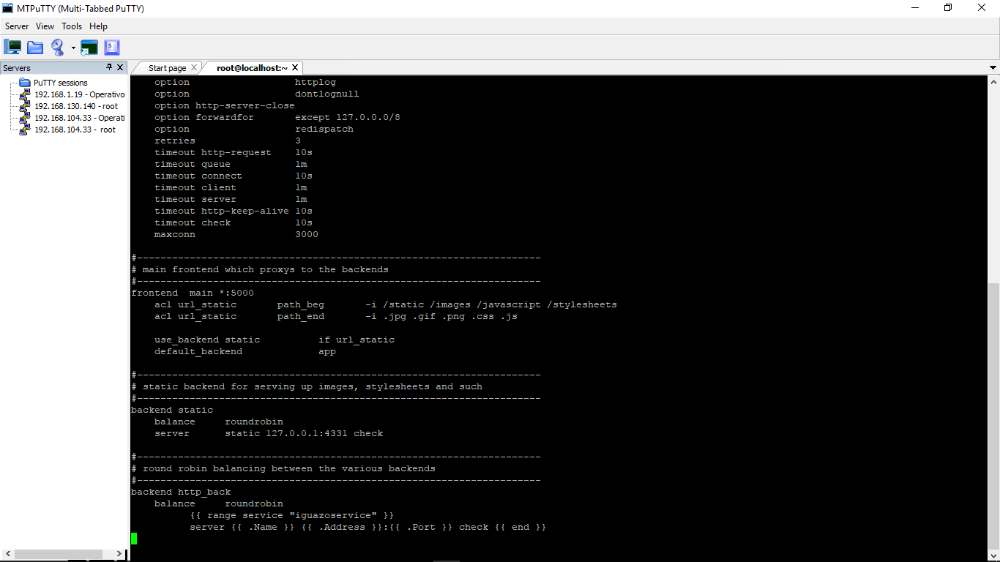
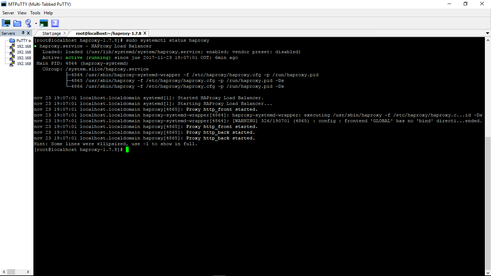
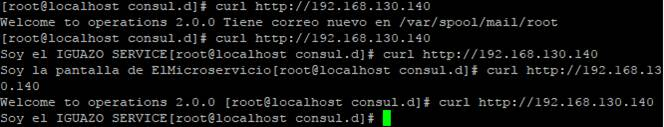

### Examen 3
**Universidad ICESI**  
**Curso:** Sistemas Operativos  
**Docente:** Daniel Barragán C.  
**Estudiante:** Alexis Córdoba Narváez  
**Código:** A00232548  
**Correo:** alexiscord1@gmail.com

### Objetivos
* Implementar servicios web que puedan ser consumidos por usuarios o aplicaciones
* Conocer y emplear tecnologías de descubrimiento de servicio

### Prerrequisitos
* Virtualbox o WMWare
* Máquina virtual con sistema operativo CentOS7
* Framework consul, zookeper o etcd

### Descripción
En este parcial se han implementado herramientas como Discovery Services, Load Balance y Consul Clients como utilidades para interacción entre Sistemas Operativos y máquinas con algún propósito específico o general con el fin de cubrir alguna necesidad en un sistema de soluciones. En este caso la muestra se hace con sencillos microservicios y elementos de una estructura que cumplirán, cada uno, su función.


### Solución.  
**Desde el Cliente: **  

3. Para llevar a cabo un despliegue como el requerido, se ha implementado un Discovery Service, un balanceador de carga y algunos clientes Consul, cada uno de ellos con un micro servicio que despliega un pequeño contenido web.


-  El microservicio ha sido creado en python y su salida obedece al siguiente código.

 
```
from flask import flask
app = Flask(_name_)

@app.route("/health")
def health():
  return "Mensaje de estado"
  
@app.route("/")
def microservice():
  return "Mensaje que quiero mostrar en la página"

if__name__ == "__main__":
  app.run(host="0.0.0.0",port=8080,debug="True")
 
```

-  Luego necesitaremos crear un ambiente de trabajo para ello, instalaremos las librerías y dependecias que nos permitirpan hacerlo:  
```
# yum install -y wget
# wget https://bootstrap.pypa.io/get-pip.py -P /tmp
# python /tmp/get-pip.py
# pip install virtualenv
# su microservices
$ pip install --user virtualenvwrapper
```
 -  Configuramos bashrc 
 
 ```
 $vi ~/.bashrc
 ```  
 Una vez abierto el editor pegamos estas líneas:  

$export WORKON_HOME=~/.virtualenvs  
$source /home/microservices/.local/bin/virtualenvwrapper.sh  
Guardamos los cambios:  

 ```
$ source ~/.bashrc
```  
-  Ahora instalaremos Flask con la ayuda de Pip:  
```
pip install Flask
```
-  Creamos nuestro ambiente:  
```
mkvirtualenv ParcialTres
workon ParcialTres
```
-  Instalamos Consul y damos apertura a los puertos que se necesitaran para la comunicación:  
```
# yum install -y wget unzip
# wget https://releases.hashicorp.com/consul/1.0.0/consul_1.0.0_linux_amd64.zip -P /tmp
# unzip /tmp/consul_1.0.0_linux_amd64.zip -d /tmp
# mv /tmp/consul /usr/bin
# mkdir /etc/consul.d
# mkdir -p /etc/consul/data
# firewall-cmd --zone=public --add-port=8301/tcp --permanent
# firewall-cmd --zone=public --add-port=8300/tcp --permanent
# firewall-cmd --zone=public --add-port=8500/tcp --permanent
# firewall-cmd --reload
```  
-  Lanzamos nuestro servicio:  

```
python miMicroservicio
```
```
echo '{"service": {"name": "miMicroservicio", "tags": ["flask"], "port": 8080,
  "check": {"script": "curl localhost:8080/health >/dev/null 2>&1", "interval": "10s"}}}' >/etc/consul.d/miMicroservicio.json
```
**Desde el Servidor: **  

- Desde el lado del servidor, repetimos la instalación y configuración de las librerías e independencias de Flask y Consul. Y ejecutamos desde el lado del servidor, las siguientes líneas de comando:  
```
consul agent -server -bootstrap-expect=1 \
   -data-dir=/etc/consul/data -node=agent-server -bind=DIRECCION_IP \
   -enable-script-checks=true -config-dir=/etc/consul.d -client 0.0.0.0
```

**Desde el Cliente: **  

- Nos activamos como clientes y luego nos unimos al servidor:  

```
#consul agent -data-dir=/etc/consul/data -node=CODIGO_ESTUDIANTE \
    -bind=DIRECCION_IP -enable-script-checks=true -config-dir=/etc/consul.d
#consul join DIRECCION_IP_SERVIDOR
```

**Capturas de CONSUL**  

  
  

**Captura WEB**  
Al ingresar la IP correspondiente al cliente podemos ver la salida que genera:  
  

**Salida en Terminal de Consul (ESTADO)**  
  

-  Para el balanceador de carga usamos los siguiente comandos:  
```
# yum install -y wget haproxy unzip
# wget https://releases.hashicorp.com/consul-template/0.19.4/consul-template_0.19.4_linux_amd64.zip -P /tmp
# unzip /tmp/consul-template_0.19.4_linux_amd64.zip -d /tmp
# mv /tmp/consul-template /usr/bin
# mkdir /etc/consul-template
# firewall-cmd --zone=public --add-port=5000/tcp --permanent
# firewall-cmd --reload
# vi /etc/consul-template/haproxy.tpl 
```  
La última linea nos permite configurar haproxy.pl.  
Una vez abierto el editor, seguimos la configuración mostrada a continuación:  

  

Luego, reiniciamos el servicio:  
```
sudo systemctl restart haproxy
```  
A continuación, la salida de la ejecución del balanceador:  
  

4.  A través del comando curl podemos ver que en cada réplica hay una salida distinta (de un microservicio idéntico):  
```
curl http://192.168.130.140
```
Y en las salidas debe mostrar diferentes resultados de los micro servicios así:  
  

5. Los cambios y cosas a tener en cuenta serían:  
Implementando APIGATEWAY tendríamos un solo fragmento de cóodigo con un único proposito en un único ambiente o máquina evitando sobrecarga de información, además facilitaría la actualización del mismo ya que esta se haría una sola vez.  
Implementando REACTIVE PARADIGM facilitará la interacción de los nuevos servicios con los ya existente dentro del diseño del ambiente.  
Implementando LOAD BALANCER ayudará a que se distribuya la carga entre los nuevos microservicios agregados y los nuevos, por tanto esta herramienta deberá estar configurada de tal manera que pueda identificar el nuevo microservicio y que la distribución de los recusos sea acorde a los requerimientos tanto del sistema como del microservicio.  
Implementar la metodología publicador/suscriptor puede ayudar al ingreso de nuevos microservicios a nuestros ambientes y debe estar configurado para no recibir cualquier microservicio dentro de nuestros ambientes, sino, que de alguna manera puedan autenticarse dentro de nuestros ambientes y ante el publicador.  
De esta manera, con estas restricciones y requeriemientos se puede tener no sólo dos sino más microservicios corriendo en un ambiente.  


### Referencias
https://github.com/ICESI/so-microservices-python  
http://microservices.io/patterns/microservices.html  
http://microservices.io/patterns/apigateway.html
https://github.com/ICESI/so-discovery-service  
https://www.upcloud.com/support/haproxy-load-balancer-centos/  
https://en.wikipedia.org/wiki/Reactive_programming
